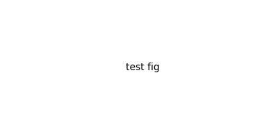

# 技术交底材料

| 专利申请案号 |  | 专利申请人 |  |
|---|---|---|---|
| 发明人 | 张三 | 联系方式 | 138xxxxxxxx |

## 1、发明名称

一种基于CT图像的扫描轨迹**数据集**生成方法

## 2、技术领域

本发明涉及医疗数据与人工智能技术领域，具体涉及自动生成扫描轨迹数据集的方法。

- 数据采集成本极高：需要医生、患者、设备同时在场
- 样本规模受限：难以覆盖不同体型

### 4.1 本发明所要解决的技术问题

利用临床已存在的海量CT数据，关键公式为 `skin_mask = solid_mask XOR eroded_mask`。

1. 通过AI模型自动分割脏器与皮肤
2. 通过刚性配准融合多期标签

```json
{
  "patient_id": "PA589",
  "side": "left",
  "func_y_coeffs": [-43.66, 2.161, 0.0236, 7.42e-05]
}
```



[图2：组织分割效果图] -- 展示多器官分割的三维结果

> 注意：负值坐标为 RAS 物理坐标系（mm）。
